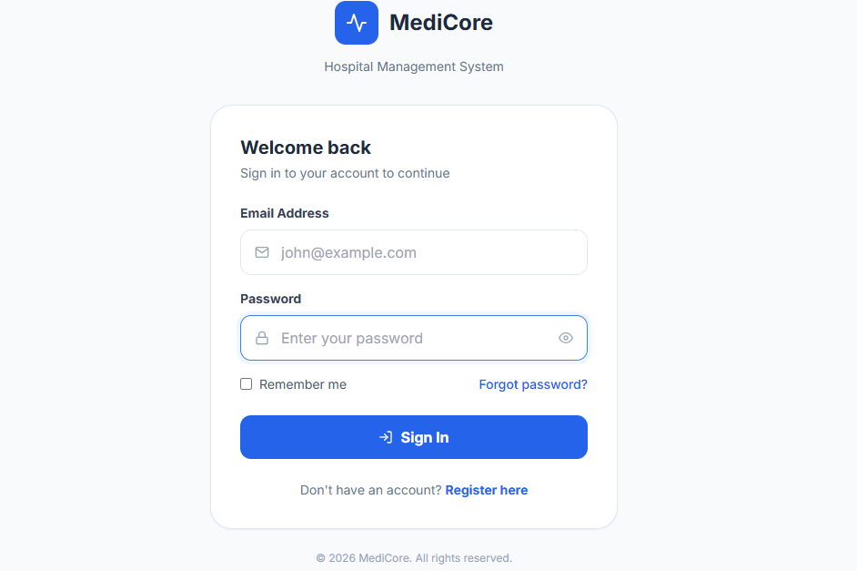
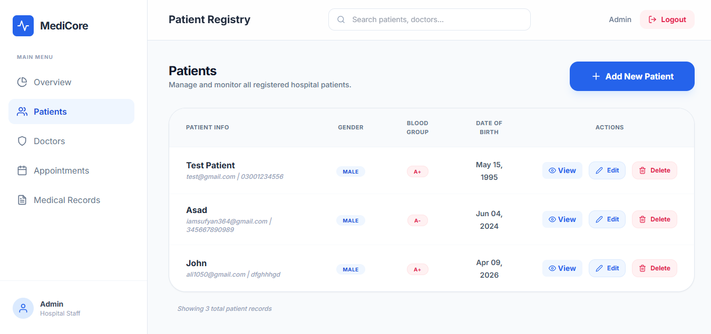
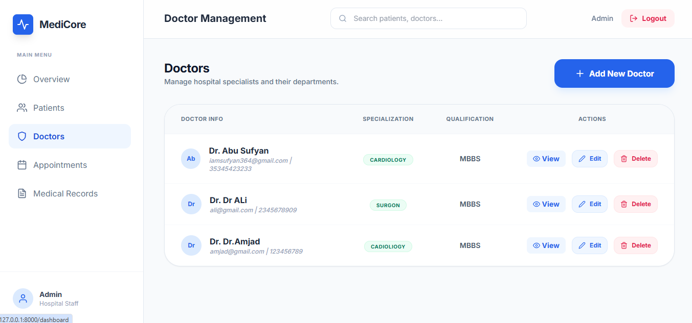
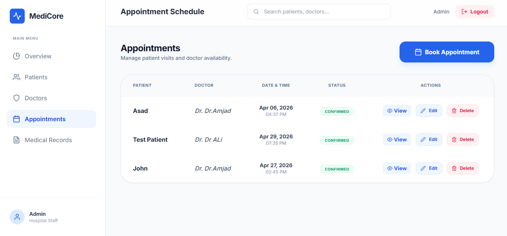
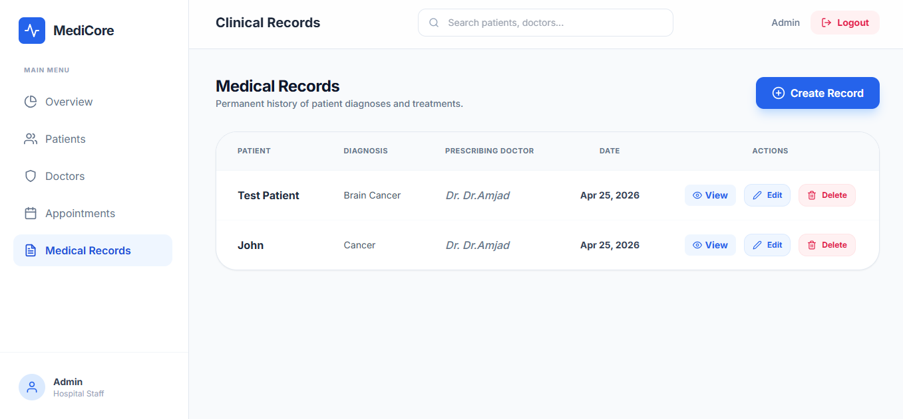

<h1 align="center">
  <br>
  🏥 Medicore
  <br>
  Hospital Management System
  <br>
</h1>

<p align="center">
  
  
  
  
</p>

<p align="center">
  A comprehensive, full-stack Hospital Management System built with Laravel — designed to streamline patient care, doctor coordination, and appointment workflows in one unified platform.
</p>

---

## 📋 Table of Contents

- [Overview](#-overview)
- [Screenshots](#-screenshots)
- [Features](#-features)
- [Tech Stack](#-tech-stack)
- [Getting Started](#-getting-started)
- [Project Structure](#-project-structure)
- [Contributing](#-contributing)
- [License](#-license)

---

## 🌟 Overview

**Medicore** is a robust Hospital Management System developed to digitize and automate core hospital operations. It provides dedicated modules for managing patients, doctors, and appointments — all backed by a secure, optimized MySQL database and a clean, responsive interface.

> **Timeline:** April 2026

---

## 📸 Screenshots

### 🔐 Login Page

<p align="center">
  
</p>

---

### 📊 Dashboard

<p align="center">
  
</p>

---

### 👤 Patient Management

<p align="center">
  
</p>

---

### 🩺 Doctor Management

<p align="center">
  
</p>

---

### 📅 Appointment Scheduling

<p align="center">
  
</p>

### 📅 Medical Record

<p align="center">
  
</p>

---

## ✨ Features

### 👤 Patient Management
- Register and manage complete patient profiles
- Track medical history and visit records
- Manage patient information efficiently

### 🩺 Doctor Management
- Add and manage doctor profiles with specializations
- Assign doctors to departments
- Track doctor availability and schedules

### 📅 Appointment Scheduling
- Book, update, and cancel appointments
- Real-time availability checking
- Appointment status tracking (Pending / Confirmed / Completed / Cancelled)

### 🗄️ Optimized Database
- Normalized relational schema for clean data integrity
- Optimized MySQL relationships and indexed queries
- Efficient CRUD operations throughout all modules

---

## 🛠 Tech Stack

| Layer | Technology |
|-------|-----------|
| Backend Framework | Laravel (PHP) |
| Frontend Styling | Tailwind CSS |
| Database | MySQL |
| Authentication | Laravel Auth / Sanctum |
| Server | Apache / Nginx |

---

##  Getting Started

### Prerequisites

Make sure you have the following installed:

- PHP >= 8.1
- Composer
- MySQL >= 5.7
- Node.js & npm
- Laravel CLI

### Installation

### 1️⃣ Clone the repository

```bash
git clone https://github.com/abusufyan01/medicore.git
cd medicore
```

### 2️⃣ Install PHP dependencies

```bash
composer install
```

### 3️⃣ Install Node dependencies

```bash
npm install && npm run dev
```

### 4️⃣ Configure environment

```bash
cp .env.example .env
php artisan key:generate
```

### 5️⃣ Set up the database

Open `.env` and update your database credentials:

```env
DB_CONNECTION=mysql
DB_HOST=127.0.0.1
DB_PORT=3306
DB_DATABASE=medicore
DB_USERNAME=your_db_user
DB_PASSWORD=your_db_password
```

### 6️⃣ Run migrations and seed data

```bash
php artisan migrate --seed
```

### 7️⃣ Start the development server

```bash
php artisan serve
```

Visit:

```bash
http://localhost:8000
```

---

## 📁 Project Structure

```bash
medicore/
├── app/
│   ├── Http/
│   │   ├── Controllers/
│   │   │   ├── PatientController.php
│   │   │   ├── DoctorController.php
│   │   │   ├── AppointmentController.php
│   │   │   └── Auth/
│   │   └── Middleware/
│   └── Models/
│       ├── Patient.php
│       ├── Doctor.php
│       └── Appointment.php
├── database/
│   ├── migrations/
│   └── seeders/
├── resources/
│   └── views/
├── routes/
│   └── web.php
├── screenshots/
├── .env.example
├── composer.json
└── README.md
```

---

## 🤝 Contributing

Contributions are welcome!

To contribute:

1. Fork the repository
2. Create a feature branch

```bash
git checkout -b feature/your-feature
```

3. Commit your changes

```bash
git commit -m "Add some feature"
```

4. Push to the branch

```bash
git push origin feature/your-feature
```

5. Open a Pull Request

---

## 📄 License

This project is licensed under the [MIT License](LICENSE).

---

<p align="center">
  Built with ❤️ using Laravel & Tailwind CSS
</p>